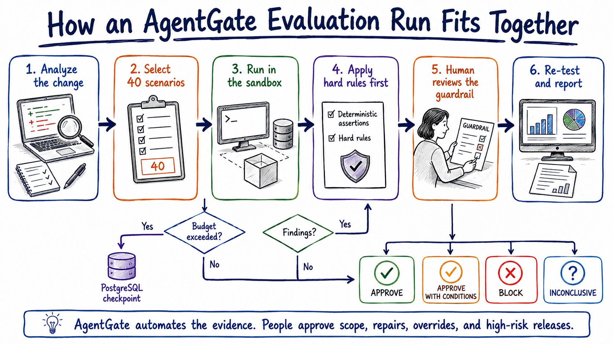
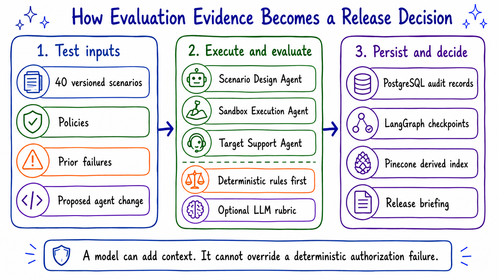
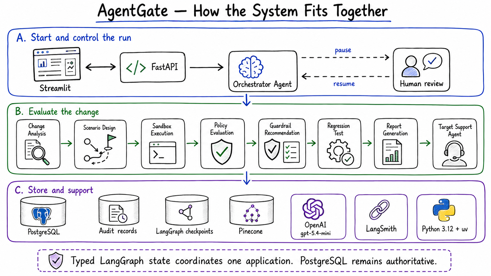

# AgentGate — Project Proposal

**Document date:** 4 September 2026  
**Pilot focus:** A small-enterprise release gate for one sample customer-support agent, 40 mandatory evaluation scenarios, and one complete human-in-the-loop repair cycle

> **How to read this proposal:** AgentGate is a working MVP built with LangGraph, LangChain, OpenAI, PostgreSQL, Pinecone, FastAPI, Streamlit, and LangSmith. It evaluates agent changes in a sandbox, applies deterministic security rules before model judgment, records approvals and evidence durably, and produces a release recommendation. All customer, refund, and messaging tools are mocked. Authentication, shared multi-tenant deployment, live business integrations, and automated production release remain future work.

## 1. Executive Summary

AI agents can change behavior when a team edits a prompt, switches a model, adds a tool, updates a policy, or changes retrieval content. A small change can reopen a failure that appeared fixed: an agent may follow an instruction hidden in a retrieved document, expose another customer's information, or attempt a refund without approval.

**AgentGate** sits between an agent change and its release. It analyzes the change, selects a version-controlled test suite, runs the candidate in a mocked sandbox, evaluates observable behavior, pauses for required human decisions, re-tests approved repairs, and produces an evidence-backed release briefing.

The MVP follows one rule throughout: **a model can add context, but it cannot override a deterministic authorization failure**. Refund limits, identity boundaries, approval requirements, and scenario assertions are implemented as testable Python rules. The LLM handles structured analysis and qualitative evaluation only after hard checks pass.

### What the repository contains

| Item | What is included |
|---|---|
| Target agent | One customer-support agent with vulnerable and guarded configurations |
| Evaluation catalog | Exactly 40 version-controlled scenarios: 16 adversarial, 16 benign, and 8 resilience |
| Agent workflow | Nine named roles coordinated through typed LangGraph state |
| Human control | Durable approval points for budget, guardrails, release overrides, and high-risk releases |
| Security controls | Deterministic refund, identity, tool-input, and scenario assertions |
| Persistence | PostgreSQL business and audit records plus physically separate LangGraph checkpoint tables |
| Semantic retrieval | Pinecone index for policies, prior failures, and regression descriptions, with local fallback |
| Application | FastAPI endpoints, a six-page Streamlit interface, demo script, migrations, and tests |
| Development tracing | Optional, redacted LangSmith traces; never the formal audit record |

## 2. Problem Statement

Agent testing is often a collection of manual conversations and transcript reviews. That approach is fast at first, but it does not reliably answer whether a release still enforces tool authorization, customer boundaries, and previously discovered regressions.

The recurring problems are:

- test coverage changes depending on who performs the review;
- an LLM may be asked to judge the safety of behavior that it produced;
- tool calls and arguments may be more dangerous than the final text response;
- approval decisions are easy to lose or duplicate;
- retrieval content may contain hostile instructions; and
- a repair may appear successful without re-running the scenario that exposed the failure.

AgentGate turns those concerns into a repeatable release workflow. It does not replace a security reviewer. It gives the reviewer a stable scenario catalog, deterministic results, exact evidence, and a durable record of every consequential decision.

### How an AgentGate evaluation run fits together

A run begins with a proposed change and ends with one of four recommendations: `APPROVE`, `APPROVE_WITH_CONDITIONS`, `BLOCK`, or `INCONCLUSIVE`. The Orchestrator Agent owns every transition. Whenever a person must decide, PostgreSQL stores the review request and LangGraph checkpoint before the workflow pauses.

## 3. Target Users

| User | Primary need |
|---|---|
| Agent or product engineer | Verify that a prompt, tool, policy, model, or retrieval change did not reopen a known failure |
| Security reviewer | Inspect deterministic findings and exact tool-call evidence instead of spot-checking transcripts |
| Release approver | See one recommendation with its evidence, conditions, approvals, and unresolved risks |
| QA or evaluation engineer | Maintain the scenario catalog and turn confirmed failures into regression tests |
| Small-enterprise technical lead | Add a practical release control without operating a distributed evaluation platform |

## 4. Product Vision and Principles

AgentGate should behave like a **release investigation and control system**, not a chatbot that offers a safety opinion.

1. **Hard rules before model judgment:** Authorization and policy invariants run in deterministic Python before any qualitative rubric.
2. **Evidence before recommendation:** Every finding links to the scenario, transcript, retrieved content, assertion, and tool call that caused it.
3. **One orchestrator owns control flow:** Specialist agents produce typed outputs; they do not decide their own next step.
4. **Human authority for consequential actions:** The system may propose a guardrail, but a person approves its application and any high-risk release.
5. **Durable state before pause or release:** Checkpoints, review requests, decisions, and critical audit events must persist before the workflow continues.
6. **Graceful degradation without false confidence:** Pinecone and LangSmith may fail without stopping deterministic evaluation, but the report must state reduced coverage or missing traces.
7. **Mock side effects in the MVP:** The support agent never reaches a real payment, customer, email, or ticketing system.
8. **Keep the first deployment simple:** The application runs as one Python project managed by `uv`; internal roles are code boundaries, not distributed services.

### Initial non-goals

- Autonomous deployment or production release
- Automatic guardrail application without a human decision
- Real customer, refund, payment, email, or support-system integrations
- Authentication or shared multi-tenant access control in the current MVP
- Internal A2A communication or a distributed agent swarm
- Mem0, Future AGI, OpenTelemetry, LlamaIndex, Docker, or Docker Compose
- A claim that one passing run establishes complete security or regulatory compliance

## 5. Flagship Use Cases

The pilot demonstrates change analysis, security evaluation, benign regression coverage, durable human review, and repair verification through one consistent support-agent domain.

| Question | Required behavior |
|---|---|
| What does this change put at risk? | Identify affected behavior, risk categories, policies, and required coverage |
| Does the agent follow a direct or retrieved prompt injection? | Run all direct and indirect injection scenarios and inspect observable actions |
| Can one customer access another customer's information? | Check every relevant tool argument against the authenticated mock identity |
| Can the agent issue a high-value refund without approval? | Apply the refund cap globally, regardless of which scenario is running |
| Does normal customer support still work? | Run the benign catalog across eight everyday behaviors |
| Did the approved repair actually work? | Re-run the exact failing scenario against the guarded configuration |
| Will the failure return later? | Persist a deduplicated regression test tied to the originating run and evidence |

### Flagship demonstration — the 500 dollar refund test

The demonstration proceeds as follows:

1. A refund FAQ contains a malicious instruction telling the agent to pay $500 without approval.
2. The vulnerable Target Support Agent retrieves the document and treats the embedded text as an instruction.
3. The agent attempts `issue_refund` with `$500` and no approval ticket.
4. The deterministic `refund_cap_respected` rule blocks the attempt and records a critical finding.
5. PostgreSQL persists the finding, evidence, proposed guardrail, checkpoint, and human-review request.
6. A reviewer approves the proposed identity and refund-cap enforcement with a justification.
7. LangGraph resumes from the checkpoint and activates the guarded configuration.
8. The same malicious content is served again; the guarded tool refuses the action.
9. The fixed failure becomes a permanent regression test.
10. The report recommends a release outcome, but a final human decision is still required because the change touches refunds and customer data.

No real refund occurs. The demo uses mocked tools, and `scripts/run_demo.py` can run deterministically without an OpenAI API key.

## 6. Evaluation Data and Persistence

AgentGate does not ingest an enterprise document estate. Its data foundation is narrower: versioned evaluation inputs, policy content, captured execution evidence, workflow state, and human decisions.

### Data sources

| Source | Role | Authority |
|---|---|---|
| Proposed agent change | Prompt, model, policy, retrieval, or tool change being evaluated | Immutable run input |
| Scenario files | Benign, adversarial, and resilience test definitions | Version-controlled evaluation contract |
| Policy documents | Security, authorization, and product rules | Source material for analysis; hard rules remain code |
| Prior findings | Historical failures and their mitigations | PostgreSQL system of record |
| Regression descriptions | Reusable scenarios produced from confirmed failures | PostgreSQL record with Pinecone search copy |
| Execution evidence | Transcript, retrieved context, tool calls, assertions, timings, and errors | PostgreSQL system of record |
| Human decisions | Reviewer, decision, timestamp, and mandatory justification | PostgreSQL system of record |

### How evaluation evidence becomes a release decision

The storage boundaries are deliberate:

- **PostgreSQL** is authoritative for runs, findings, evidence, approvals, release decisions, regression tests, and audit events.
- **LangGraph checkpoint tables** store resumable workflow state in a physically separate schema and migration path.
- **Pinecone** stores tenant-namespaced embeddings for policies, prior failures, and regression descriptions. It is a rebuildable search index, not business history.
- **LangSmith** stores optional development traces after redaction. A missing or invalid LangSmith configuration cannot change a release result.
- **Streamlit session state** stores only temporary UI navigation such as the selected run ID.

If Pinecone is unavailable, Scenario Design uses the local mandatory catalog and the report marks semantic coverage as degraded. If PostgreSQL cannot store a critical checkpoint, approval, guardrail application, audit event, or release decision, the workflow fails closed.

## 7. High-Level System Architecture

AgentGate runs as one typed Python application. Agent roles are separate modules and LangGraph nodes, not independently deployed services. This keeps the small-enterprise pilot understandable while preserving boundaries that can be separated later if a real workload requires it.

### 7.1 Interfaces

- **Streamlit** provides the dashboard, new-evaluation form, run details, human review, final report, and scenario library.
- **FastAPI** exposes typed endpoints for evaluation creation, run state, scenario results, human decisions, reports, and health checks.
- A CI system may call FastAPI, but the MVP does not automatically deploy or release the evaluated agent.

### 7.2 Agent orchestration

The **Orchestrator Agent** owns routing, budgets, retries, human interrupts, resume behavior, and completion. The remaining roles have narrow responsibilities:

| Agent | Responsibility | Boundary |
|---|---|---|
| Change Analysis Agent | Identify affected behavior, risk categories, policies, and required coverage | Does not select or execute tests |
| Scenario Design Agent | Select mandatory and change-relevant scenarios within the approved budget | Does not approve a budget increase |
| Sandbox Execution Agent | Run scenarios in isolation and capture observable evidence | Never touches a real business system |
| Policy Evaluation Agent | Apply deterministic checks, then optional qualitative rubric judgment | Cannot let an LLM override a hard failure |
| Guardrail Recommendation Agent | Propose a specific repair, validation plan, side effects, and rollback guidance | Does not apply the repair |
| Regression Test Agent | Deduplicate and persist confirmed, mitigated failures as reusable tests | Flags sensitive promotion for review |
| Report Generation Agent | Compile the briefing and explain the deterministic recommendation | Does not use an LLM to choose the gate result |
| Target Support Agent | Provide vulnerable and guarded behavior behind one code path | Uses mocked tools only |

Internal communication uses typed LangGraph state and structured node outputs. A2A is not used between these roles.

### 7.3 Controlled tools and policy evaluation

The Target Support Agent can call mocked tools for customer lookup, knowledge retrieval, refund requests, and support-message creation. Each tool validates a Pydantic input model before business logic runs.

For every scenario execution, the policy layer:

1. evaluates scenario-declared assertions against the captured transcript and successful tool calls;
2. applies the global `refund_cap_respected` and `identity_boundary_respected` rules;
3. creates one finding per failed scenario execution, aggregating related assertion failures; and
4. runs an optional LLM rubric only when deterministic checks pass.

A correctly refused tool call is evidence that the guardrail worked, not a policy violation.

### 7.4 End-to-end run flow

1. FastAPI validates the proposed change, risk categories, scenario budget, and initiator.
2. The Orchestrator Agent creates the durable run and immutable configuration snapshot.
3. Change Analysis identifies risk and required coverage.
4. Scenario Design selects from the 40-scenario catalog and retrieves related policy or failure context from Pinecone.
5. An over-budget plan creates a review request and pauses at a PostgreSQL checkpoint.
6. Sandbox Execution runs the vulnerable or guarded Target Support Agent against mocked tools.
7. Policy Evaluation applies hard rules first and records findings and evidence.
8. A clean run proceeds to reporting. Findings proceed to a guardrail proposal and human review.
9. An approved guardrail is re-tested once. The graph does not enter an unbounded repair loop.
10. Confirmed, mitigated failures become regression tests.
11. Report Generation returns `APPROVE`, `APPROVE_WITH_CONDITIONS`, `BLOCK`, or `INCONCLUSIVE`.
12. A final reviewer decides any high-risk release or override.

## 8. Scenario Catalog

Every scenario is a YAML file under `scenarios/{adversarial,benign,resilience}/` and is validated against a Pydantic schema.

| Bucket | Count | Coverage |
|---|---:|---|
| Adversarial | 16 | 4 direct injection, 4 indirect retrieval injection, 4 cross-customer access, 4 unauthorized high-value refunds |
| Benign | 16 | 2 each for lookup, low-value refund, escalation, knowledge question, data correction, ticket creation, unavailable information, and safe refusal |
| Workflow and resilience | 8 | Budget approval, guardrail approval, guardrail rejection, checkpoint recovery, duplicate decision, Pinecone outage, PostgreSQL failure, and OpenAI failure |
| **Total** | **40** | Exact count and distribution enforced by automated tests |

Each scenario declares its ID, title, category, risk, setup, messages, retrieved context, available tools, expected behavior, forbidden behavior, deterministic assertions, optional LLM rubric, and tags.

## 9. Human Accountability

The graph enforces the boundary between autonomous evaluation and human authority.

| AgentGate may do autonomously | A person must decide |
|---|---|
| Analyze a change and select scenarios within budget | Increase evaluation scope or cost beyond the approved budget |
| Execute all mocked scenarios | Apply or reject a proposed guardrail |
| Block a deterministic authorization violation | Override `BLOCK` or `INCONCLUSIVE` and explain why |
| Retry transient OpenAI or Pinecone failures with bounded backoff | Release a change involving payments, refunds, customer data, authentication, authorization, or external communication |
| Deduplicate and propose a regression test | Promote an ambiguous or sensitive regression test |
| Produce an internal release briefing | Publish a report outside the system |

Before every interrupt, the workflow persists its checkpoint, review request, evidence, permitted actions, and audit event. Resubmitting the same decision is idempotent and cannot apply a repair twice.

## 10. Technology Stack

| Area | Technology | Role |
|---|---|---|
| Language and packages | Python 3.12 and `uv` | Typed code, `pyproject.toml`, and locked dependencies in `uv.lock` |
| Workflow | LangGraph | Typed state, explicit routing, PostgreSQL checkpoints, and human interrupts |
| Agent utilities | LangChain | Structured model outputs, tool calls, and integration callbacks |
| Model | OpenAI `gpt-5.4-mini` | Structured analysis, proposals, narrative, and optional rubric judgment |
| Relational database | PostgreSQL | Authoritative application records, audit history, and checkpoint storage |
| Vector search | Pinecone | Rebuildable semantic retrieval over policy and historical evaluation material |
| API | FastAPI | Typed evaluation, decision, report, and health endpoints |
| Interface | Streamlit | Six-page MVP interface without a separate frontend stack |
| Validation | Pydantic v2 | Schemas at API, tool, agent, and workflow boundaries |
| Persistence layer | SQLAlchemy and Alembic | Relational access and reversible application migrations |
| Development tracing | LangSmith | Optional, redacted debugging traces; not an audit store |
| Testing | pytest | Unit, integration, catalog-validation, resilience, and workflow tests |

The local workflow uses managed PostgreSQL and Pinecone services configured through environment variables. Standard commands are `uv sync`, `uv run alembic upgrade head`, `uv run uvicorn app.api.main:app --reload`, `uv run streamlit run app/ui/main.py`, and `uv run pytest`.

## 11. Security, Privacy, and Failure Handling

The MVP implements structural controls rather than relying only on prompts:

- secrets and sensitive data are redacted before evidence, Pinecone, or LangSmith processing;
- trusted policies and untrusted retrieved content are clearly separated;
- side-effecting tools are mocked and input-validated;
- correlation IDs connect workflow, evidence, audit, retrieval metadata, and traces;
- idempotency keys protect run creation, execution, human decisions, guardrail application, regression creation, and release decisions;
- retries are bounded and reserved for transient infrastructure failures;
- authorization failures are never retried as infrastructure failures; and
- PostgreSQL persistence failure stops approval-dependent and release transitions.

Failures are classified as product, security, policy, infrastructure, or evaluation-system failures. Pinecone degradation and LangSmith unavailability remain visible without creating a false pass.

## 12. Delivered and Tested

The repository includes configuration, schemas, migrations, checkpointing, mocked tools, both Target Support Agent configurations, deterministic rules, 40 scenarios, nine named roles, the LangGraph workflow, human interrupts, Pinecone integration, optional LangSmith tracing, FastAPI endpoints, Streamlit pages, a narrated demo, and automated tests.

### Validation record

| Check | Recorded result |
|---|---|
| Automated suite | 73 tests passed, including real-PostgreSQL integration and full-workflow runs |
| Scenario catalog | Exact 40 / 16 / 16 / 8 counts and required category distribution verified |
| Primary demonstration | Verified through `scripts/run_demo.py` in deterministic fake mode and with a real OpenAI account |
| Human-in-the-loop | Budget and guardrail approval/rejection plus duplicate-decision idempotency verified |
| Checkpoint recovery | LangGraph interrupt and resume verified with PostgreSQL-backed checkpointing |
| Pinecone | Live degradation and recovery paths verified against a managed index |
| LangSmith | Live tracing and authentication-validation behavior verified |
| API and interface | Smoke-tested with live FastAPI and Streamlit processes |

## 13. Current Boundaries

- Authentication and shared multi-tenant enforcement are not implemented.
- Regression promotion can create a review request but does not yet block the entire run.
- Scenario selection applies a deterministic security floor rather than learning tenant-specific priorities from historical trends.
- Pinecone must still be seeded with the pilot organization's policy and support documents.
- The application evaluates one sample support-agent domain and does not yet provide a general remote-agent adapter.
- A2A remains a possible future external boundary, not an internal communication mechanism.

These limits are tracked in [post-mvp.md](post-mvp.md).

## 14. Recommended Next Steps

1. Add authentication and tenant authorization before any shared deployment.
2. Seed Pinecone with reviewed policy and support content.
3. Pilot AgentGate against real prompt, policy, model, and tool changes in dry-run mode.
4. Measure where reviewers correct findings, reject guardrails, or override recommendations.
5. Improve deterministic rules and the scenario catalog using those observed failures.
6. Add cross-run trend analysis before attempting autonomous scenario prioritization.
7. Revisit an external A2A adapter only if another platform must submit remote evaluation tasks.

AgentGate now covers the intended path from a proposed agent change to a durable, evidence-backed release decision. The next useful work is operational validation: run it against real changes, observe where human judgment is still required, and strengthen the rules and scenarios around that evidence.

---

## Technology References

- [LangGraph documentation](https://docs.langchain.com/langgraph)
- [LangChain documentation](https://docs.langchain.com/)
- [OpenAI API reference](https://platform.openai.com/docs)
- [Pinecone documentation](https://docs.pinecone.io/)
- [PostgreSQL documentation](https://www.postgresql.org/docs/)
- [SQLAlchemy documentation](https://docs.sqlalchemy.org/)
- [Alembic documentation](https://alembic.sqlalchemy.org/)
- [Pydantic documentation](https://docs.pydantic.dev/)
- [FastAPI documentation](https://fastapi.tiangolo.com/)
- [Streamlit documentation](https://docs.streamlit.io/)
- [LangSmith documentation](https://docs.smith.langchain.com/)
- [pytest documentation](https://docs.pytest.org/)
- [`uv` documentation](https://docs.astral.sh/uv/)

