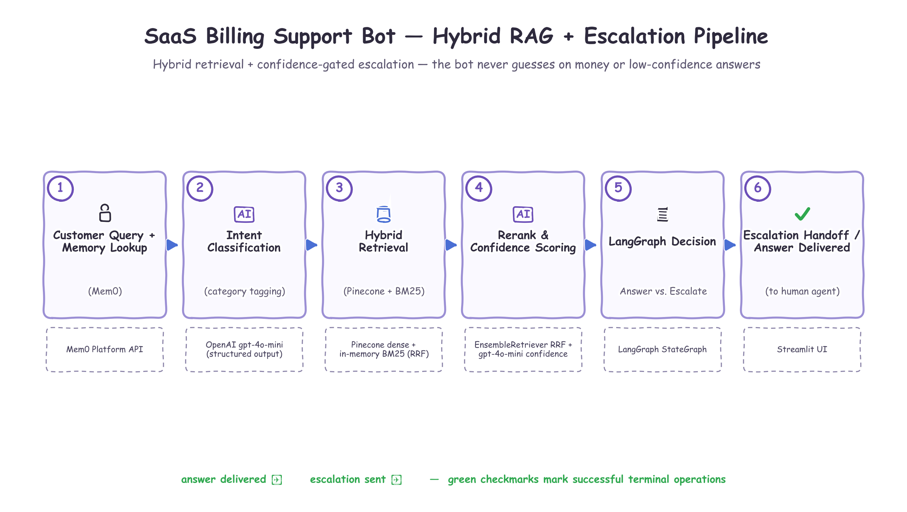

# SaaS Billing & Subscription Support Bot — Project Documentation

A working MVP of a SaaS billing and subscription support chatbot that combines **hybrid
retrieval** (dense + keyword search) with **confidence-based escalation** to a human agent. The
core design principle: the bot refuses to guess. When it isn't confident, or a query involves a
real dollar amount, it escalates instead of hallucinating an answer.

This document covers what the system does, the technologies behind it, and how the pieces fit
together. For the narrower architecture write-up (pipeline stages, threshold table, memory
boundary) see [`architecture.md`](architecture.md); this document is the broader project
reference.

---

## 1. Supported Functionalities

### Customer-facing (Streamlit chat)

- **Conversational chat UI** — plain-language message bubbles, no JSON/raw scores/source IDs in
  the main thread.
- **Grounded answers with source attribution** — every answered message shows a readable source
  badge (e.g. "Source: FAQ: FAQ-002"), not a raw source ID.
- **Category badge per exchange** — Refund, Proration, Payment Failure, Cancellation,
  Upgrade/Downgrade, Invoice Dispute, or General Policy — visible without being intrusive.
- **Confidence-gated escalation** — a reassuring "connecting you to a specialist" message
  (never phrased like an error), paired with an icon + text label (not color alone, for
  accessibility) whenever the bot isn't confident enough to answer.
- **"How I got this answer" panel** (collapsed by default, per message) — the debug/agent view:
  confidence score, category, detected dollar amount, escalation reason, the final retrieved
  sources with citations, and a full **hybrid retrieval breakdown** (see below).
- **Hybrid retrieval transparency** — inside that panel, three tables show exactly how the
  answer's sources were found: the Pinecone dense-search ranking, the BM25 keyword-search
  ranking, and the final Reciprocal-Rank-Fusion (RRF) blended ranking with each source's
  dense rank, BM25 rank, and computed RRF score.
- **Typing/loading indicator** while retrieval and generation run.
- **Per-customer long-term memory panel** in the sidebar — plan tier, prior issues, prior
  escalations, and stated preferences for the current Customer ID, once Mem0 has context.
- **Conversation reset** — clears the chat window (Mem0 memory persists separately, keyed by
  Customer ID, so it survives a reset).
- **Responsive layout** — reads cleanly at desktop and narrower widths (Streamlit's default
  responsive behavior).

### Retrieval & knowledge grounding

- **Three-tier synthetic knowledge base**: ~35 resolved support tickets, ~22 FAQs, and 6
  pricing/plan docs, each tagged by `source_type` and `category`.
- **Chunking**: `RecursiveCharacterTextSplitter(chunk_size=500, chunk_overlap=100)` over all
  three sources, with a stable `chunk_id` shared between the Pinecone index and the in-memory
  BM25 corpus so results from both retrievers can be matched up.
- **Hybrid search**: Pinecone dense vector search (semantic) + in-memory BM25 (keyword),
  fused via `EnsembleRetriever`'s Reciprocal Rank Fusion (equal 0.5/0.5 weighting, RRF
  constant c=60) — no separate cross-encoder/Cohere rerank stage needed, since the RRF-fused
  rank is itself a materially better confidence signal than raw cosine or BM25 scores alone.
- **Category-aware filtering** — retrieval can filter the Pinecone side by category once the
  classifier has tagged the query.
- **Idempotent ingestion** — `src/ingest.py` upserts by deterministic `chunk_id`, so re-running
  it is always safe.

### Confidence & escalation logic

- **Structured LLM output** (OpenAI structured output via `gpt-4o-mini`) for every generation
  call: `answer`, `citations`, `confidence`, `category`, `dollar_amount`, `escalate`,
  `escalation_reason` — never free text.
- **Per-category escalation thresholds**, centralized and deterministic (`src/confidence.py`),
  never left to the LLM to decide alone:
  - **Money-moving** (`refund`, `proration`, `invoice_dispute`): confidence ≥ 0.90 **and**
    unconditional escalation if the detected dollar amount exceeds **$100**, regardless of
    confidence.
  - **Informational/process** (`general_policy`, `payment_failure`, `cancellation`,
    `upgrade_downgrade`): confidence ≥ 0.60.
- **Answer redaction** — if the final decision is to escalate, `answer` is force-set to `null`
  before it ever reaches the UI, even if the model produced a non-null answer.
- **Vagueness-aware confidence** — the generation prompt explicitly requires low confidence
  when a query is too underspecified to resolve (e.g. "something's wrong", "do something about
  it"), instead of letting a correct-but-generic policy answer masquerade as high confidence.
- **Escalation handoff packaging** — when escalating, the original query, retrieved sources,
  the bot's draft answer (if any), its confidence, and the escalation reason are all available
  together (surfaced in the debug panel; ready to hand to a human agent).

### Long-term customer memory (Mem0)

- **Separate from the retrieval knowledge base** — Mem0 holds customer-specific context (plan
  tier, prior issues, prior escalations with category + reason, stated preferences), not
  product/policy knowledge.
- **Read at the start of every turn** and injected as background context into both
  classification and generation — explicitly framed to the LLM as **"background only, never a
  citation source"** and never allowed to raise confidence about the current query.
- **Written at the end of every turn** via a dedicated LLM summarization call that decides
  what's actually durable-worth-remembering (not the full transcript); escalations are always
  recorded regardless of that summarizer's judgment.
- **Escalation-override rule** — a customer with 2+ prior escalations in the same category is
  escalated immediately on their next query in that category, without re-attempting a bot
  answer, even if the current turn's confidence looks high.
- **Fail-safe** — any Mem0 error (read or write) is caught and treated as "no memory available"
  rather than blocking or crashing the response.
- **Disableable module** (`memory.MEMORY_ENABLED`) so the eval harness can compare behavior
  with and without memory, and so the harness can reset a customer's memory between runs
  (`reset_customer_memory`) — necessary because Mem0 Platform is a persistent hosted store that
  does not clear itself between separate script runs.

### Evaluation harness

- **20-query test set** (`eval/test_queries.json`) spanning all 7 categories — a mix of
  clear-cut informational questions (expect: answer), underspecified/ambiguous questions
  (expect: escalate), and money-specific questions over the $100 cap (expect: escalate
  regardless of confidence).
- **Dual-mode run** — every query runs once with Mem0 memory disabled (fresh customer per
  query) and once with it enabled (a single shared customer across all 20 queries in sequence,
  reset to a clean slate first), so continuity effects on escalation accuracy are visible
  instead of being invisible to single-shot testing.
- **Metrics reported**: First-Contact Resolution (FCR) rate, overall decision accuracy,
  escalation precision/recall, and an automated possible-hallucination proxy (any surfaced
  answer with zero citations).
- **Markdown report** (`eval/results_report.md`) — per-query expected-vs-actual table for both
  passes, plus a top-level Summary section: a metrics comparison table, every missed label per
  pass, and every query where memory changed the bot's decision versus the no-memory run.
- **LangSmith trace reference** included in the report when tracing is enabled.
- **30-question manual test script** (`eval/manual_test_scenarios.md`) for exercising the
  Streamlit UI by hand, including 5 multi-turn scenarios specifically designed to exercise
  Mem0 memory (plan-tier recall, preference recall, prior-issue recall, the escalation-override
  rule, and cross-session persistence).

### Reliability / operations

- **Graceful degradation everywhere** — a Pinecone, OpenAI, or Mem0 failure never crashes the
  UI; retrieval/generation failures degrade to a forced escalation with a `system_error`
  reason, and Mem0 failures degrade to "no memory available."
- **All secrets via `.env`** (see `.env.example`) — never hardcoded.
- **`uv`-only tooling** — dependency management, environment setup, and execution
  (`uv sync`, `uv run ...`) throughout; no pip/venv/poetry/conda anywhere.

---

## 2. Technology Stack

| Layer | Technology | Version (as installed) | Why |
|---|---|---|---|
| Language / runtime | Python | 3.12+ | Project baseline. |
| UI | Streamlit | 1.62.0 | Fast, batteries-included chat UI with built-in chat components, expanders, and session state. |
| LLM generation & classification | OpenAI `gpt-4o-mini` (via `openai` 3.3.1) | — | Cheap and fast enough to run classification + structured-output generation on every turn, plus a 20-query eval suite twice per run. |
| Embeddings | OpenAI `text-embedding-3-small` | — | Cheap, good-quality embeddings for a small synthetic knowledge base (1536-dim). |
| Orchestration components | LangChain | 1.3.16 | Supplies the wrappers this project's components are built from: `ChatOpenAI`, `OpenAIEmbeddings`, `PineconeVectorStore`, `RecursiveCharacterTextSplitter`, structured-output parsing. |
| LLM wrapper | `langchain-openai` | 1.6.0 | `ChatOpenAI` / `OpenAIEmbeddings` with `.with_structured_output(...)`. |
| Vector store integration | `langchain-pinecone` | 0.2.13 | `PineconeVectorStore` — dense-only vector store wrapper over Pinecone. |
| BM25 + legacy retrievers | `langchain-community` / `langchain-classic` | 0.4.2 / 1.0.8 | `BM25Retriever` (community) and `EnsembleRetriever` (classic) — in-memory keyword search and RRF fusion. |
| Control flow | LangGraph | 1.2.11 | Explicit `StateGraph` — classify → retrieve → generate → score_and_decide → save_memory — instead of an `AgentExecutor` or one-shot `RetrievalQA`, so escalation logic is deterministic and auditable. |
| Vector database | Pinecone (`pinecone` client) | 7.3.0 | Managed dense vector store, no infra to run; serverless index created automatically by `src/ingest.py`. |
| Keyword search | `rank_bm25` (via `BM25Retriever`) | 0.2.2 | Pure in-memory BM25 over the same source knowledge base — no separate persistence layer needed for ~65 chunks. |
| Tracing & eval harness | LangSmith | 0.11.1 | Auto-instruments every LangChain/LangGraph run once `LANGCHAIN_TRACING_V2` is set — no manual tracing code. |
| Long-term memory | Mem0 Platform (`mem0ai`) | 2.0.18 | Hosted per-customer memory store, separate from the retrieval KB; no local vector DB needed just for customer context. |
| Data models / structured output | Pydantic | 2.13.4 | Schemas for `BotResponse`, `ClassificationResult`, `RetrievedDoc`, `CustomerMemory`, `MemorySummary` — the contract structured LLM output is validated against. |
| Secrets | `python-dotenv` | 1.2.3 | Loads `.env` for local development; `st.secrets` supported for Streamlit deployment. |
| Diagramming | Matplotlib (xkcd mode) | 3.11.1 | Generates the hand-drawn-style architecture diagram (`Document/generate_diagram.py`) — the closest scriptable approximation to an Excalidraw sketch aesthetic without external tooling. |
| Package management | `uv` | — | `uv sync` / `uv run` exclusively for environment setup, dependency locking (`uv.lock`), and execution. |

---

## 3. Architecture

### 3.1 Pipeline overview



*(Also available as [`architecture-diagram.svg`](architecture-diagram.svg) for lossless
scaling; regenerate with `uv run python Document/generate_diagram.py`.)*

Implemented as a **linear, deterministic** LangGraph `StateGraph` (`src/graph.py`) with six
nodes: `load_memory → classify → retrieve → generate → score_and_decide → save_memory`. There
is no `AgentExecutor` and no one-shot `RetrievalQA` — control flow is explicit code, not
something an LLM improvises, because the escalation logic this project depends on has to be
auditable.

### 3.2 Module breakdown

| Module | Responsibility |
|---|---|
| `src/schemas.py` | Pydantic models for every structured contract in the system: `BotResponse` (the generation output schema), `ClassificationResult`, `RetrievedDoc` (with `dense_rank`/`bm25_rank`/`rrf_score` for retrieval transparency), `CustomerMemory`, `PriorEscalation`, `MemorySummary`. Also the category label maps and the escalation constants ($100 cap, 0.90/0.60 thresholds, memory-override count). |
| `src/ingest.py` | One-shot script: loads and chunks the knowledge base, creates the Pinecone serverless index if missing, embeds with `text-embedding-3-small`, and upserts by deterministic `chunk_id` (idempotent). |
| `src/retrieval.py` | Loads/chunks the three knowledge-base sources; builds the BM25 retriever (in-memory, cached) and the Pinecone vector retriever; `hybrid_search()` runs both independently, computes each chunk's dense rank / BM25 rank / RRF score, and returns `{fused, dense, bm25}`. |
| `src/confidence.py` | `THRESHOLDS` per category and `decide()` — the single, centralized, deterministic authority over the final escalate/answer decision. Applies the $100 money-moving rule, the confidence bar, and the memory-override rule; can only push toward escalation, never override one back to "answer." |
| `src/memory.py` | Mem0 Platform wrapper: `get_customer_context()` (read, fail-safe), `save_turn_summary()` (LLM-summarized durable write), `reset_customer_memory()` (used by the eval harness), and the `MEMORY_ENABLED` toggle. |
| `src/graph.py` | The LangGraph `StateGraph` itself: node functions, the classification/generation prompts (with the vagueness-aware and memory-boundary confidence rules baked in), and `run(customer_id, query)` — the single entry point used by both `app.py` and `eval/run_eval.py`. Every external call is wrapped so a failure degrades to a forced escalation instead of raising. |
| `app.py` | Streamlit UI: chat thread, source/category badges, the escalation banner, the "How I got this answer" expander (confidence, category, dollar amount, escalation reason, retrieved sources, and the hybrid retrieval breakdown tables), and the sidebar (Customer ID, reset button, customer-context panel). |
| `eval/run_eval.py` | Runs the 20-query test set through `graph.run()` twice (memory off / memory on, with a memory reset in between), computes FCR/precision/recall/hallucination-proxy, and writes `eval/results_report.md` including a synthesized bottom-line Summary section. |

### 3.3 Confidence & escalation logic

The generation node returns a structured `BotResponse`. `confidence.decide()` is the final,
authoritative decision-maker — it can only escalate more aggressively than the LLM's own guess,
never less:

| Category group | Confidence bar | Dollar rule |
|---|---|---|
| `refund`, `proration`, `invoice_dispute` (money-moving) | ≥ 0.90 | Escalate unconditionally if `dollar_amount > $100`, regardless of confidence |
| `general_policy`, `payment_failure`, `cancellation`, `upgrade_downgrade` (informational/process) | ≥ 0.60 | — |

If the decision is to escalate, `answer` is redacted to `null` before it reaches the UI — the
customer never sees a sub-threshold or otherwise-escalated answer, even if the model produced
one.

### 3.4 Memory boundary (Mem0)

Mem0 is intentionally a separate module and a separate concern from the retrieval knowledge
base:

- **Read** at the start of every turn, injected into classification and generation prompts as
  **background only** — both prompts explicitly forbid using it as a citation source or as a
  reason to raise confidence about the current query.
- **Written** at the end of every turn via an LLM summarization call that decides what's
  actually durable; escalations are always recorded regardless.
- **Escalation override**: 2+ prior escalations in the same category forces immediate
  escalation on the next query in that category.
- **Fails safe**: any Mem0 error is treated as "no memory available," never a blocker.

### 3.5 Error handling

Every external call (Pinecone, OpenAI, Mem0) is wrapped. A Pinecone or OpenAI failure sets a
`system_error` flag on the graph state; downstream nodes short-circuit and
`score_and_decide` turns it into a forced escalation (`escalate=True`,
`escalation_reason="System error: ..."`) rather than raising into the Streamlit UI. A Mem0
failure is swallowed inside `memory.py` itself and simply yields no memory context.

---

## 4. Data / Knowledge Base

| Source | Count | Fields |
|---|---|---|
| `data/tickets.json` | ~35 resolved support tickets | `id`, `category`, `subject`, `customer_message`, `resolution`, `dollar_amount` |
| `data/faqs.json` | ~22 FAQ entries | `id`, `category`, `question`, `answer` |
| `data/pricing_docs/*.md` | 6 plan/pricing docs | frontmatter `id`/`category` + markdown body |

All three sources are chunked identically (`RecursiveCharacterTextSplitter`, size 500 /
overlap 100) into ~65 chunks total, each tagged with `source_id`, `source_type`
(`ticket`/`faq`/`pricing_doc`), and `category` — the same tags used for citation display,
category-filtered retrieval, and the money-moving vs. informational threshold split.

---

## 5. Repository Structure

```
billing-support-bot/
├── Document/
│   ├── PROJECT_DOCUMENTATION.md   # this file
│   ├── architecture.md            # focused architecture write-up
│   ├── architecture-diagram.png / .svg
│   └── generate_diagram.py        # regenerates the diagram
├── data/
│   ├── tickets.json
│   ├── faqs.json
│   └── pricing_docs/*.md
├── src/
│   ├── ingest.py
│   ├── graph.py
│   ├── retrieval.py
│   ├── confidence.py
│   ├── memory.py
│   └── schemas.py
├── eval/
│   ├── test_queries.json
│   ├── manual_test_scenarios.md
│   ├── run_eval.py
│   └── results_report.md
├── app.py
├── pyproject.toml / uv.lock
├── .env.example
└── README.md
```

## 6. Known Limitations / Calibration Notes

- **LLM confidence calibration is empirical, not guaranteed** — the 0.90/0.60 thresholds are
  policy decisions, but `gpt-4o-mini`'s actual confidence estimates on any given phrasing can
  drift over model updates. The eval harness exists specifically to catch this kind of drift;
  re-run it after any prompt or model change.
- **Mem0 Platform's delete is asynchronous** (`reset_customer_memory` triggers a background
  delete, not an immediate one) — code that needs a guaranteed-clean read immediately after a
  reset should wait briefly, as the eval harness does.
- **No real authentication** — Customer ID is a free-text field in the sidebar, suitable for an
  MVP/demo, not production identity.
- **Synthetic data only** — the knowledge base is authored for this project, not real support
  history; retrieval quality on a real, larger corpus would need re-tuning (chunk size,
  ensemble weights, top-k).
