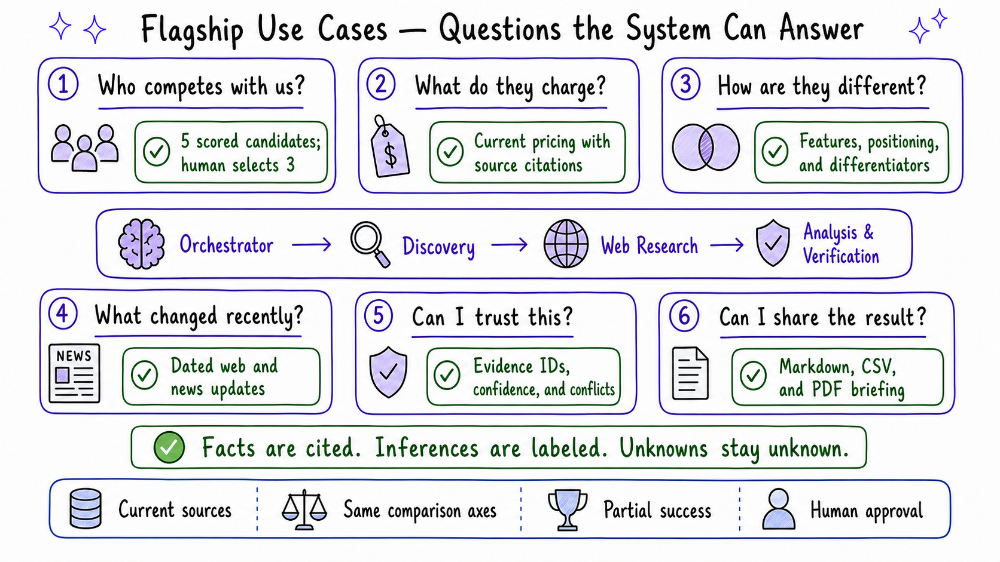

# Market Research Agent

## A practical competitor-research workflow for small enterprises

| Document | Project overview |
|---|---|
| Intended users | Founders, product teams, consultants, analysts, and technical reviewers |
| Pilot scope | One target company, five candidates, three human-approved competitors, and one cited briefing |

This document explains what we built, why we made the main design choices, and
where the current implementation stops. Setup instructions are in
[SETUP.md](SETUP.md), and the code-level architecture is documented in
[ARCHITECTURE.md](ARCHITECTURE.md).

---

## Contents

1. [What the product does](#1-what-the-product-does)
2. [The problem we set out to solve](#2-the-problem-we-set-out-to-solve)
3. [How a research run works](#3-how-a-research-run-works)
4. [Who it is for](#4-who-it-is-for)
5. [Where automation stops](#5-where-automation-stops)
6. [Search and evidence ingestion](#6-search-and-evidence-ingestion)
7. [Architecture](#7-architecture)
8. [Agent responsibilities and control flow](#8-agent-responsibilities-and-control-flow)
9. [State and audit history](#9-state-and-audit-history)
10. [Technology choices](#10-technology-choices)
11. [Quality and safety controls](#11-quality-and-safety-controls)
12. [What has been delivered and tested](#12-what-has-been-delivered-and-tested)
13. [What we learned and what comes next](#13-what-we-learned-and-what-comes-next)

---

## 1. What the product does

The Market Research Agent turns a company name and a bounded research scope
into a cited competitor briefing. It is aimed at a small team that needs a
useful market scan but does not have a dedicated competitive-intelligence
function.

A typical run answers four questions:

- Who are the most relevant competitors?
- What do they offer?
- What do they charge?
- What has changed recently?

The system does not send a single broad prompt to an LLM and hope for a good
report. It separates the work into discovery, evidence collection, analysis,
and report compilation. A person chooses the three competitors that deserve
deeper research before the more expensive part of the run begins.

The four agent roles are:

- **Competitor Discovery Agent:** proposes and scores five candidates.
- **Web Research Agent:** gathers web and news evidence for each approved
  competitor. You.com is always used; Serper.dev can be added as a second
  provider.
- **Analysis & Verification Agent:** extracts claims, links them to evidence,
  and records uncertainty or conflicts.
- **Orchestrator Agent:** manages the run, approvals, retries, budgets, and
  final compilation.

PostgreSQL is the formal record of what happened. Pinecone retrieves relevant
evidence during analysis, and LangSmith remains the primary development trace
and evaluation workspace. Future AGI is an optional, separately enabled
quality layer: it can trace the same LangChain/LangGraph activity and its
`evaluate()` API scores dedicated discovery, analysis, and batch-scenario
scripts. It does not participate in production routing or replace the audit
trail. The final Markdown, CSV, and PDF exporters use the verified records
already stored by the pipeline; they do not ask an LLM to rewrite the facts
one more time.

### What a completed run provides

| Area | Result |
|---|---|
| Discovery | Five candidates scored as direct, indirect, or emerging competitors |
| Human review | Exactly three competitors selected for full research |
| Research | Current web and news evidence collected independently for each competitor |
| Analysis | Pricing, features, customers, positioning, differentiators, and recent changes |
| Trust | Evidence IDs, source URLs, confidence, conflicts, and explicit unknowns |
| Failure handling | A partial report when one branch cannot be completed |
| Output | Cited Markdown, CSV, and PDF briefings |

---

## 2. The problem we set out to solve

Competitor research is usually assembled from browser tabs, copied snippets,
and notes written at different times. That works for a quick conversation but
breaks down when somebody asks where a price came from, whether a feature is
still available, or why one company was classified as a direct competitor.

We focused on five recurring problems:

| Problem | What it causes | How the MVP responds |
|---|---|---|
| Information becomes stale | Teams compare old prices or positioning | Every run performs fresh web and news searches |
| Notes use different formats | Comparisons become subjective | Pydantic schemas keep the same fields for every competitor |
| Sources disappear from the write-up | Claims are hard to defend | Claims retain evidence IDs that resolve to source URLs |
| One failed search stops the job | Useful work is discarded | Each competitor runs in an independent branch |
| Open-ended agents keep working | Cost and completion time are unclear | Budgets, retries, and completion rules are enforced in Python |

This is a decision-support tool. It can shorten the collection and comparison
work, but it is not intended to make a final strategy decision on behalf of a
founder, consultant, or product manager.

---

## 3. How a research run works

Each run leaves a traceable chain from the original request to the final
briefing. PostgreSQL stores the business records and events in that chain;
Pinecone stores the searchable representation of the collected evidence.


*Future AGI is intentionally outside these numbered production stages. When
enabled, it observes the LangChain/LangGraph activity; the separate eval and
batch-scenario scripts exercise the same agents without changing this run
sequence.*

The sequence is straightforward:

1. The user supplies the target company, industry, geography, customer
   segment, news window, and budget.
2. Discovery queries You.com and returns five scored candidates.
3. The user selects exactly three. The API validates this rule even if the
   interface is bypassed.
4. Before full research starts, the graph estimates the cost. A higher budget
   requires approval.
5. One Web Research branch runs for each competitor. Every active branch uses
   You.com and, when configured, Serper.dev.
6. Search results are merged, validated, deduplicated, embedded, and stored.
7. The Analysis & Verification branches retrieve evidence by competitor and
   category and produce typed claims.
8. A coverage check accepts the profile, requests targeted gap research, or
   marks the branch incomplete.
9. The exporters build the cited briefing from the stored profiles and
   evidence records.

Human approval happens before the three full research branches. If a branch
still lacks enough evidence after its retry allowance is exhausted, the other
branches continue and the briefing carries a visible warning.

### One deliberate constraint

`app/export/markdown_exporter.py` formats verified data without another model
call. We chose this because a final “make this sound better” prompt could add a
claim that had never passed through evidence validation.

---

## 4. Who it is for

The MVP is most useful when the research question is bounded and the user can
review the result before acting on it.

| User | Likely use |
|---|---|
| Founder or small-business owner | Prepare a first market landscape without hiring an analyst |
| Product manager | Compare current features, pricing, and positioning |
| Sales or competitive-intelligence contributor | Create source-backed talking points |
| Consultant | Produce a repeatable starting point for client research |
| Analyst or student | Study a working multi-agent research and verification pipeline |

### Flagship use cases



| Question | What the system returns |
|---|---|
| Who competes with us? | Five scored candidates, followed by a human-selected shortlist of three |
| What do they charge? | Pricing details with currency, cadence, date, and source context when available |
| How are they different? | Comparable features, customers, positioning, and differentiators |
| What changed recently? | Dated web and news findings inside the requested time window |
| Can I trust this? | Source links, confidence, conflicts, and unknown values |
| Can I share it? | A cited Markdown, CSV, or PDF briefing |

In a live RunPod research run, for example, the company-description claim in
the exported briefing resolved to the actual source title and URL rather than
showing an internal evidence UUID. That small detail matters: citations are
only useful when a reader can follow them.

---

## 5. Where automation stops

We wanted the agents to handle repetitive research work without quietly
crossing into business decisions. The split below is enforced by workflow and
API rules, not just described in prompts.

| The system can do on its own | A person must decide |
|---|---|
| Generate and refine search queries | Which three competitors receive full research |
| Retry transient provider failures | Whether to raise the approved budget |
| Deduplicate and categorize evidence | How to resolve a material conflict that cannot be reconciled safely |
| Run targeted research for missing categories | Whether a partial or low-confidence report is ready for external use |
| Preserve missing information as unknown | Whether to publish or write results into another business system |

The current version deliberately does **not** include:

- unrestricted crawling or general-purpose page scraping;
- scheduled monitoring and alerts;
- enterprise SSO or multi-tenant SaaS administration;
- autonomous email, CRM, roadmap, or publishing actions;
- remote A2A agent services;
- conversational memory through Mem0 or another memory service; or
- any claim that the system replaces human strategic judgment.

Those features may be useful later, but adding them now would make a small
deployment harder to operate without improving the core briefing.

---

## 6. Search and evidence ingestion

You.com is the required search provider. It is used for both candidate
discovery and full competitor research. Serper.dev is optional and is used
only by the Web Research Agent. When enabled, it gives the research branches a
second search index without changing the rest of the ingestion pipeline.


### Provider behavior

| Provider | Required? | Current behavior |
|---|---|---|
| You.com | Yes | Always queried; also powers competitor discovery |
| Serper.dev | No | Used alongside You.com only when `SERPER_ENABLED=true` and an API key is present |

Both clients implement the `SearchClient` interface in
`app/clients/search_client.py`. The Web Research Agent therefore receives the
same result shape from either provider. Each accepted evidence record retains
its provider name, URL, query, category, and dates.

Enabling Serper.dev adds one search request per research category and increases
the pre-flight estimate accordingly. The implementation and mocked tests are
in place, but this provider has not yet been exercised with a live Serper.dev
account. Its per-call price in the cost table is also a placeholder and should
be replaced before production billing is presented to users.

### Research categories

Each competitor is researched across 11 categories. Company description is
kept as context; the other ten contribute to the coverage score.

| Category | Included in coverage? |
|---|---|
| Company description | No |
| Pricing | Yes |
| Core features | Yes |
| Target customers | Yes |
| Positioning | Yes |
| Differentiators | Yes |
| Announcements | Yes |
| Recent news | Yes |
| Free trial | Yes |
| Customer reviews | Yes |
| Notable customers | Yes |

### What happens to a search result

- The pipeline checks company relevance, source quality, and dates.
- Canonical URLs and content hashes prevent duplicates from inflating
  confidence, including duplicates returned by different providers.
- Results become LangChain documents and are split when necessary. The current
  chunk size is 1,000 characters with 150 characters of overlap.
- OpenAI embeddings are stored in a Pinecone workspace namespace.
- Vector IDs are derived from the evidence ID and chunk index, so retrying an
  upsert does not create new copies.
- Retrieval always filters on `run_id`, `competitor_id`, and `category`.
- PostgreSQL keeps the source record and its relationship to later claims.

All retrieved text is treated as untrusted content. It is evidence for the
model to inspect, not a new set of instructions for the agent.

---

## 7. Architecture

The MVP runs as one Python application. The agent roles are separate in code,
but they are not independently deployed services. This keeps local setup and
debugging manageable while leaving client and graph boundaries that could be
moved into services later.


*Future AGI and LangSmith receive diagnostic traces through dashed paths; neither
platform approves competitors, changes budgets, or routes production work.*

### Main components

| Component | Responsibility |
|---|---|
| Streamlit | Research form, competitor approval, progress, results, and downloads |
| FastAPI | Validation and endpoints for runs, approvals, status, and exports |
| LangGraph | Workflow state, fan-out, routing, retries, budgets, and coverage checks |
| LangChain | Prompts, structured model output, documents, embeddings, and retrieval interfaces |
| You.com | Required search and news data for discovery and research |
| Serper.dev | Optional second search and news provider for research |
| Pinecone | Scoped semantic retrieval over evidence chunks |
| PostgreSQL | Runs, selections, evidence, claims, costs, reports, events, and checkpoints |
| LangSmith | Development traces, evaluations, latency, and selected production diagnostics |
| Future AGI | Optional tracing through `LangChainInstrumentor` plus `evaluate()` scoring for dedicated eval scripts and the project-local batch scenario runner |

The three competitor branches are concurrent instances of the same Web
Research and Analysis definitions. We do not maintain six separate agents.
That distinction reduces prompt drift and makes fixes apply consistently to
every competitor.

---

## 8. Agent responsibilities and control flow

Each agent has a narrow job and a boundary it is not allowed to cross.

| Agent | Receives | Produces | Does not do |
|---|---|---|---|
| Orchestrator | Research scope and graph state | Plans, routing decisions, and compiled briefing | Add new facts during report compilation |
| Competitor Discovery | Target company and scope | Five scored candidates | Choose the final three |
| Web Research | One competitor, categories, and active search clients | Deduplicated evidence IDs and coverage metadata | Write strategic conclusions |
| Analysis & Verification | Retrieved evidence for one competitor | Typed claims, confidence, conflicts, and coverage | Cite evidence it did not retrieve |

The graph applies the following rules:

- external requests have timeouts and bounded retries;
- authentication and malformed requests are not treated as transient errors;
- a task is attempted no more than three times;
- projected search and model costs are checked before full research;
- missing categories can trigger a targeted research pass while budget remains;
- a failed branch stays visible in the report status; and
- only verified structured records reach the report compiler.

Provider-specific HTTP code lives in `app/clients/`. `YouComClient` and
`SerperClient` implement the same search contract; `PineconeClient` owns
vector operations; and the OpenAI, LangSmith, and Future AGI setup functions
are isolated from agent logic. Future AGI imports are deferred, so the normal
application still starts when its optional dependency group is absent. Tests
can replace external clients with fakes rather than making paid requests.

---

## 9. State and audit history

There are four kinds of state in the application, and they are not equally
authoritative.

| Location | What it holds | Role |
|---|---|---|
| LangGraph state | Current branches, errors, coverage, retries, and approvals | Drives the active workflow |
| PostgreSQL | Business records and audit events | Formal system of record |
| Pinecone | Embedded evidence chunks and retrieval metadata | Search index, not business history |
| Streamlit `session_state` | Browser selections and navigation | Temporary UI convenience |

The durable record follows this shape:

```text
workspace
  └── run
      ├── discovery candidates
      ├── approved competitor selections
      ├── research evidence
      │   └── Pinecone chunks
      ├── competitor profiles
      │   └── claims → evidence IDs
      ├── costs and audit events
      └── briefing and exports
```

Pinecone can be rebuilt from the evidence records. PostgreSQL cannot be
replaced by Pinecone because it stores the authoritative relationships among
runs, approvals, sources, claims, and costs.

LangSmith and Future AGI hold diagnostic traces and evaluation results, not
product state. A trace may be sampled, masked, disabled, or unavailable
without changing the authoritative run recorded in PostgreSQL.

---

## 10. Technology choices

| Area | Technology | Why it is here |
|---|---|---|
| Language | Python 3.12+ | Typed application and data-processing code |
| Workflow | LangGraph | Conditional routing and concurrent branches with explicit state |
| Agent/RAG utilities | LangChain | Structured outputs, documents, splitting, embeddings, and retrieval |
| Models | OpenAI | Query generation, candidate scoring, claim extraction, and embeddings |
| Search | You.com and optional Serper.dev | Fresh web and news evidence from one or two indexes |
| Vector search | Pinecone Serverless | Namespace and metadata-scoped evidence retrieval |
| Database | PostgreSQL | Durable workflow records and audit history |
| API | FastAPI | Typed asynchronous endpoints |
| Interface | Streamlit | A small multipage UI without a separate frontend stack |
| Schemas | Pydantic v2 | Validation at agent and API boundaries |
| Persistence | SQLAlchemy and Alembic | Relational data access and migrations |
| Primary engineering observability | LangSmith | Trace inspection and the existing development evaluation suite |
| Optional quality cross-check | Future AGI | Secondary traces, `evaluate()` scoring, and a project-local batch scenario harness; enabled only by explicit toggle and optional dependency group |
| Reports | ReportLab plus Markdown/CSV exporters | Shareable cited output |
| Tests | pytest | Credential-free behavior and integration checks |
| Packaging | `uv` | Locked dependencies and repeatable commands |

We considered Mem0 and LlamaIndex earlier in the design. Neither solves a
current gap: fresh evidence is more important than conversational memory, and
LangChain already supplies the document and retrieval abstractions used here.
Kafka, Kubernetes, remote A2A services, and a second vector database were left
out for the same reason. They would raise the operating cost before the MVP
has a workload that requires them.

---

## 11. Quality and safety controls

Several controls are structural rather than prompt-based:

- A supported claim without evidence IDs fails Pydantic validation.
- A single source cannot produce high confidence.
- Unknown information stays unknown instead of being filled with a guess.
- Conflicting values remain separate and retain their sources.
- Workspace namespaces and metadata filters prevent cross-run retrieval.
- Budget, retry, and coverage decisions are regular Python logic.
- Retrieved pages are delimited as untrusted content before model use.

The automated tests cover discovery scoring, deduplication, chunking,
embedding failures, retrieval isolation, evidence-required claims, confidence
downgrades, coverage, conflicts, retries, budgets, partial branches, exports,
citations, audit events, migrations, prompt-injection boundaries, both search
clients, and multi-provider provenance.

LangSmith is used to debug model calls, retrieval, node timing, token usage,
and failures. It is not the customer-facing audit database. Production traces
can be sampled, masked, or disabled for a privacy-sensitive workspace, while
the required business events remain in PostgreSQL.

### Future AGI quality loop


Future AGI is deliberately opt-in. `FUTUREAGI_ENABLED=false` is the default,
and tracing starts only when both `FI_API_KEY` and `FI_SECRET_KEY` are present
and the `futureagi` dependency group has been installed. FastAPI initializes
the integration during application startup; a missing package, missing key,
or setup failure degrades to no Future AGI tracing rather than preventing the
application from starting.

Enable the optional integration with:

```bash
uv sync --group futureagi
```

```env
FUTUREAGI_ENABLED=true
FI_API_KEY=...
FI_SECRET_KEY=...
FI_PROJECT_NAME=market-research-agent
```

Keep the toggle off when external tracing is not appropriate for the
workspace. The evaluation scripts still require their own live provider
credentials because they execute the underlying agents rather than evaluating
static report text alone.

The delivered integration has three separate parts:

| Part | Implementation | Current status |
|---|---|---|
| Observe tracing | `app/clients/futureagi_client.py` registers `ProjectType.OBSERVE` and instruments LangChain/LangGraph through `LangChainInstrumentor` | Live-verified against a real Future AGI account |
| Agent evaluation | `eval/run_discovery_eval_futureagi.py` scores answer relevancy; `eval/run_analysis_eval_futureagi.py` scores claim faithfulness | Implemented, but not yet run end-to-end with live Future AGI evaluation credentials |
| Batch edge-case checks | `eval/simulation/run_simulation.py` drives four synthetic requests through the real agents, performs structural Python checks, and calls Future AGI `evaluate()` | Project-local harness; not Future AGI's native multi-turn `TestRunner` |

The distinction in the last row matters. This application is a bounded
research workflow rather than a conversational or voice agent. Its scenario
runner therefore tests the real Discovery, Web Research, and Analysis agents
directly instead of forcing them behind a chat-persona callback. The runner
writes real records and must point at a scratch database.

Future AGI does not approve competitors, raise budgets, modify graph state, or
compile the briefing. It provides traces and quality signals for a person to
review. Standalone `evaluate()` results currently print to the terminal; they
are not yet attached to trace spans for display as dashboard evaluation scores.

Because enabling both observability platforms can send the same prompt,
retrieval, and model content to two external services, production use should
apply the same sampling, masking, retention, and workspace-privacy decisions
to both. Neither integration changes the credential-free `tests/` suite.

---

## 12. What has been delivered and tested

The repository includes:

1. application configuration, logging, and locked dependencies;
2. SQLAlchemy models and reversible Alembic migrations;
3. Pydantic schemas for evidence, claims, confidence, and graph state;
4. You.com, Serper.dev, OpenAI, Pinecone, LangSmith, and Future AGI client
   boundaries;
5. the four agent roles and two LangGraph workflows;
6. PostgreSQL-backed services and FastAPI endpoints;
7. a multipage Streamlit interface;
8. Markdown, CSV, and PDF exporters;
9. automated tests plus a separate optional LLM evaluation suite; and
10. an optional Future AGI tracing layer, two Future AGI evaluation scripts,
    and a project-local batch scenario runner that uses Future AGI scoring.

### Validation record

| Check | Result |
|---|---|
| Automated suite | **49/49 test functions passed** without live provider credentials |
| Database lifecycle | Alembic upgrade → downgrade → upgrade completed against local PostgreSQL, including the `serper` provider migration |
| Discovery | A live OpenAI + You.com run produced five classified Oracle competitors |
| Research and analysis | Live OpenAI + You.com + Pinecone runs produced evidence-backed RunPod and Salesforce profiles |
| Citations | Stored evidence IDs resolved to real source titles and URLs in exported reports |
| LangSmith | Per-node timing and per-model token usage were visible in live traces |
| Serper.dev | Mock-tested and migration-verified, but not yet called with a live account |
| Future AGI tracing | Live-verified: a real LangChain call was traced with a real `FI_API_KEY`/`FI_SECRET_KEY` and force-flushed to Future AGI's collector, and confirmed visible in the Future AGI dashboard |
| Future AGI evaluation and batch scenarios | Structurally implemented; the tracing no-op path is unit-tested, but `eval/run_*_futureagi.py` and the project-local `eval/simulation/` runner have not yet been executed end-to-end against a live Future AGI evaluation account |

The core workflow is therefore live-validated with You.com. Serper.dev should
still be treated as a tested integration candidate until its request shape,
freshness behavior, quotas, and real cost have been checked with an account.
Future AGI's tracing path has cleared that same bar. Its `evaluate()` metric
identifiers and batch scenarios have not, and should be treated as integration
candidates until they have been exercised against a live evaluation account.

---

## 13. What we learned and what comes next

The main lesson from the build is that the useful part of a multi-agent system
is not the number of agents. It is the handoff contract between them. Evidence
IDs, typed outputs, deterministic routing, and clear failure states did more
for reliability than adding another autonomous role would have done.

A few choices became clearer during implementation:

- Keeping discovery separate from full research creates a natural approval
  and cost boundary.
- A final LLM rewriting pass is unnecessary when the structured profile is
  already good enough to export.
- Search snippets are often shorter than the configured chunk size, but the
  splitter is still needed for occasional longer results.
- Pinecone is useful for retrieval, but source relationships and audit events
  belong in PostgreSQL.
- A second search provider may improve coverage, but it also makes provider
  provenance, deduplication, and cost accounting more important.

### Known gaps

- Serper.dev needs a live integration run and verified pricing.
- Future AGI's `evaluate()` metric identifiers and the project-local batch
  scenarios are implemented but not yet run end-to-end against a live
  account (tracing alone has been).
- Future AGI eval scores from `eval/run_*_futureagi.py` and
  `eval/simulation/` are currently local-only: standalone `evaluate()` calls
  are not attached to a trace/span, so they print to the terminal but do not
  yet appear in the Future AGI dashboard.
- Cost projection still uses estimates rather than actual model usage
  metadata.
- Per-competitor progress could be clearer in the interface.
- The product has been exercised on a small number of companies and needs
  repeated use across industries before its confidence rules can be tuned.
- Authentication, container deployment, and background workers are not part
  of the current local MVP.

### Recommended next steps

1. Live-test Serper.dev and replace its placeholder price.
2. Run `eval/run_discovery_eval_futureagi.py`,
   `eval/run_analysis_eval_futureagi.py`, and
   `eval/simulation/run_simulation.py` against a live Future AGI evaluation
   account. Confirm that `faithfulness` and `answer_relevancy` remain the best
   metric identifiers for the installed SDK version.
3. If dashboard-visible eval scores are wanted (not just terminal output),
   attach Future AGI eval calls to the run's trace/span instead of calling
   `evaluate()` standalone.
4. Record actual model usage and exact provider requests in the cost ledger.
5. Add first-class progress events for each competitor branch.
6. Run the LangSmith and Future AGI evaluation suites regularly, compare their
   results over time, and require human review when the two judges disagree.
7. Pilot the workflow in several industries and review where coverage and
   confidence disagree with a human analyst.
8. Add authentication or deployment infrastructure only when a real hosting
   requirement justifies it.
9. Revisit A2A if an agent eventually becomes a separately deployed service or
   a customer-controlled integration boundary.

The MVP now completes the intended path from discovery to a cited briefing.
The next useful work is operational learning: run it repeatedly, note where a
person has to correct it, and improve those parts before expanding the stack.

---

## Technology references

- [FastAPI documentation](https://fastapi.tiangolo.com/)
- [Streamlit documentation](https://docs.streamlit.io/)
- [LangGraph documentation](https://docs.langchain.com/langgraph)
- [LangChain documentation](https://docs.langchain.com/)
- [OpenAI API reference](https://platform.openai.com/docs)
- [You.com API documentation](https://you.com/docs/welcome)
- [Serper.dev documentation](https://serper.dev/)
- [Pinecone documentation](https://docs.pinecone.io/)
- [PostgreSQL documentation](https://www.postgresql.org/docs/)
- [SQLAlchemy documentation](https://docs.sqlalchemy.org/)
- [Alembic documentation](https://alembic.sqlalchemy.org/)
- [Pydantic documentation](https://docs.pydantic.dev/)
- [LangSmith documentation](https://docs.smith.langchain.com/)
- [Future AGI documentation](https://docs.futureagi.com/)
- [ReportLab user guide](https://www.reportlab.com/docs/reportlab-userguide.pdf)
- [pytest documentation](https://docs.pytest.org/)
- [`uv` documentation](https://docs.astral.sh/uv/)
